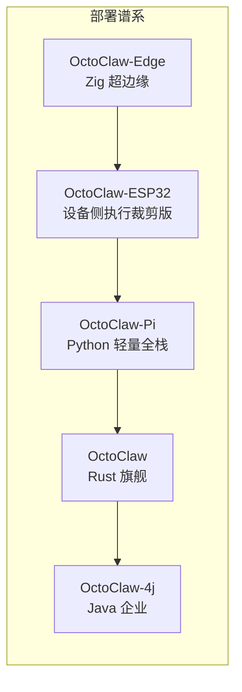
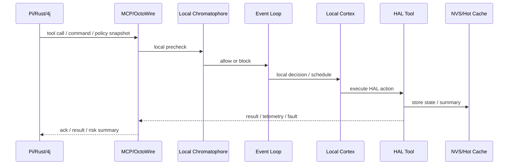

# OctoClaw-ESP32 架构设计文档（设备侧执行裁剪版）

> **OctoClaw-ESP32 = OctoClaw 母架构在 MCU / FreeRTOS / ESP-IDF 世界中的设备侧实现。**  
> 它必须继承 OctoClaw 的协议语义、会话语义、零信任边界与 OctoWire / MCP 协同方式，但会根据 **MCU 资源、Flash / PSRAM、外设中断、OTA 与设备安全** 做最强裁剪：**保留本地执行与设备自治，复杂大脑能力上移到 Pi / Rust / 4j。**

[](#)
[](#)
[](#)

---

**文档约定**：本文按 Rust 母架构同步 ESP32 版本，但明确设备侧与上游大脑的边界；「ESP32」即 OctoClaw-ESP32；「上游」通常指 Pi / Rust / 4j 节点。

**ESP32 的裁剪原则**：
- **必须保留**：设备身份、Session / command 对应关系、OctoWire / MCP 协议、零信任设备边界、局部触手执行、OTA 与安全更新；
- **设备侧最小保留**：本地 tool 调度、硬件 HAL、轻量状态机、部分 ask / agent-lite 能力；
- **默认上移**：L2 深答、复杂 Prompt 装配、完整 11 文件解析、梦境、OctoSwarm Queen、复杂审批、多租户治理；
- **职责约束**：ESP32 持续承担设备触手节点职责，保留本地安全判断、能力声明、执行边界与 OTA 恢复链。

文字总结：术语表先统一 ESP32 设备侧语义，确保 MCU 能力声明与上游协议表达一致。

| 缩写 | 含义 |
|------|------|
| HAL | 硬件抽象层，如 GPIO、I2C、SPI、UART、Camera、Audio |
| OTA | Over The Air，设备远程升级 |
| NVS | Non-Volatile Storage，ESP32 持久化配置 |
| Capability Manifest | 设备声明的工具、传感器、资源能力摘要 |

表格说明：后文提到设备能力、升级、存储与本地执行时均以本表术语为准。

---

## 目录

### Part I：战略全景与核心理念（战略与 ESP32 体现）
- 1. 为什么需要 OctoClaw-ESP32
- 2. OctoClaw-ESP32 在五版本中的位置
- 3. 三条硬约束与 ESP32 总架构
- 4. OpenClaw × ZeroClaw × OctoClaw 的分层继承（ESP32 版）

### Part II：章鱼架构——生物神经映射（战略与 ESP32 体现）
- 6. 为什么是章鱼（从隐喻到实现）
- 7. 三平面、五器官、两条兼容线
- 8. ESP-IDF / FreeRTOS 模块视角的章鱼架构
- 9. 资源约束下的 ESP32 裁剪原则
- 10. 器官协作完整流程（ESP32）
- 11. 三心脏与外套膜（ESP32）

### Part III：核心技术实现（ESP32）
- 12. Session 映射与主循环
- 13. L0/L1/L2 在 ESP32 的设备侧分工
- 13.1 四轴智能路由在 ESP32
- 14. 三套感知通路（ESP32）
- 15. 三种对话模式（ESP32）的设备映射
- 16. 零信任安全管线（11 步）与 ESP32
- 16.1 HITL / 2FA 在 ESP32 的边界
- 17. 触手池与本地工具执行（ESP32）
- 17.1 端到端消息流（ESP32）
- 17.2 设备执行后端策略与当前实现骨架（ESP32）
- 18. Agent 定义文件（11 文件约定）的设备侧裁剪装配
- 18.2 SONA 与梦境在 ESP32 的处理方式

### Part IV：OpenClaw DNA 与五版本（ESP32 为主）
- 19. OpenClaw 共同 DNA（8 条）在 ESP32 的体现
- 20. OctoClaw-ESP32（设备侧执行裁剪版）

### Part V：进阶能力在 ESP32 的体现
- 30A. 四轴智能路由
- 31A. SONA / 梦境
- 32A. OctoSwarm
- 33A. WASM Booster / 本地 Tool Capsule
- 34A. 双脑
- 35A. HITL 2FA
- 36A. a11y

### Part VI：互操作与生态
- 38. OctoWire（ESP32）
- 39. 技能生态与执行后端
- 40. ESP32 责任划分与部署判断
- 41. 部署画像与本地 / 协作边界
- 42. 迁移路径与输出物

### Part VII：工程落地
- 43. ESP32 的设备触手实现职责
- 44. 快速开始与设备上线前检查
- 45. 部署与升级
- 46. 设备控制台与嵌入边界
- 47. 配置兼容与命名分层
- 48. CLI 命令域与设备运维闭环
- 49. 资源预算与设备档位
- 50. C 接口、模块扩展点与实施顺序
- 51. ADR 与 ESP32 落点

### Part VIII：附录
- 附录 A：术语与修订历史
- 附录 B：NVS / 配置示例
- 附录 C：ESP32 的平台实现补充

# Part I：战略全景与核心理念（战略与 ESP32 体现）

## 1. 为什么需要 OctoClaw-ESP32

ESP32 版本负责把 OctoClaw 带到真实硬件末梢：

- 接管 GPIO、传感器、摄像头、麦克风、继电器、显示器等设备；
- 在本地执行低时延、强实时、强安全的动作；
- 与上游大脑协作，形成“云端 / 边缘 / 设备”三级章鱼体系；
- 通过设备身份、配对、OTA、工具白名单保证不会被 Agent 任意乱用。

### 1.1 ESP32 的三大非妥协目标

文字总结：三大目标定义 ESP32 的设备自治边界，确保本地执行链、安全链和协议链不断开。

| 目标 | 强约束 | ESP32 体现 |
|------|--------|------------|
| **保留设备侧自治** | 本地必须能做安全判断、能力声明、执行回执 | Capability Manifest、tool whitelist、local policy |
| **保留协议与会话语义** | 不改写 Session / command / reply-back 基本语义 | MCP / OctoWire / device session mapping |
| **尊重 MCU 边界** | 不伪装成全功能大脑 | 深推理、复杂 Prompt、群体共识、梦境默认上移 |

表格说明：左列给目标，第二列给约束，第三列给 ESP32 本地落点，可直接用于设备验收。

## 2. OctoClaw-ESP32 在五版本中的位置

### 2.1 ESP32 的职责

ESP32 是 OctoClaw 体系中的 **设备触手节点**：

- 承担本地传感与执行；
- 通过上游下发的目标与策略完成局部执行；
- 向上游回传设备状态、执行结果与安全摘要；
- 在网络不稳定时保持最小自治与回退策略。

### 2.2 五版本职责分工



文字总结：该表用于定位 ESP32 在家族中的设备职责，以及与上游版本的协作边界。

| 版本 | 部署职责 | ESP32 本地边界 |
|------|------|----------------|
| Edge | 小型 Linux 板 | ESP32 负责 MCU 侧硬件实时与设备执行边界 |
| **ESP32** | 设备触手节点 | 本文档 |
| Pi | 本地轻量大脑 | Pi 常作为 ESP32 的上游协调节点 |
| Rust | 全功能母体 | 提供复杂推理、策略、兼容基线 |
| 4j | 企业治理 | 提供审批、租户、组织级安全 |

表格说明：第一列是版本角色，第二列是部署职责，第三列专门标注 ESP32 的本地能力封套。

## 3. 三条硬约束与 ESP32 总架构

### 3.1 硬约束 A：设备侧协议语义不能乱

ESP32 可以不理解完整 Prompt，但必须理解：

- 设备身份与配对；
- command / tool call / reply / ack / error 的协议口径；
- Session 与 device task 的映射；
- capability、risk、approval-required 等状态语义。

### 3.2 硬约束 B：硬件边界必须大于模型输出

ESP32 不应直接相信上游模型输出，而应始终经过本地边界：

- 工具白名单；
- 参数范围校验；
- 物理安全阈值；
- 本地 emergency stop；
- OTA 签名验证；
- NVS 加密与设备证书。

### 3.3 硬约束 C：章鱼器官仍有设备映射

| 器官 | ESP32 设备映射 |
|------|----------------|
| Cortex | 本地轻决策：是否执行、是否上移、如何回退 |
| Tentacles | HAL / local agent / tool runner |
| Neural | command queue、event loop、interrupt、watchdog |
| Mantle | NVS 热状态、环形缓冲、少量摘要缓存 |
| Chromatophore | 本地策略阈值、风险判断、回复等级 |

## 4. OpenClaw × ZeroClaw × OctoClaw 的分层继承（ESP32 版）

| 来源 | 继承内容 | ESP32 的裁剪 |
|------|----------|--------------|
| OpenClaw | 会话语义、skill / tool / policy 的 scope 概念 | 本地保留 manifest，不解析完整 Workspace |
| ZeroClaw | lean runtime、可替换 channel / transport、设备 profile 思路 | 用 FreeRTOS task、静态缓冲实现 |
| OctoClaw | 五器官、零信任、OctoWire、生命周期 | 保留设备侧最小闭环，上移大脑能力 |

---

# Part II：章鱼架构——生物神经映射（战略与 ESP32 体现）

## 6. 为什么是章鱼（从隐喻到实现）

ESP32 是“触手末梢”场景的直接落点：一个设备可以独立感知、独立执行、局部判断风险，并持续接受更高层大脑协调。该版本集中承载“局部自治 + 中央协调”的章鱼关系。

## 7. 三平面、五器官、两条兼容线

| 平面 / 器官 | ESP32 体现 |
|-------------|------------|
| Assistant Plane | manifest、capability、scope 摘要 |
| Runtime Plane | FreeRTOS、Wi-Fi、MCP、OTA、NVS |
| Lifecycle Plane | local cortex、tool tentacles、event loop、hot memory、risk layer |
| OpenClaw 兼容线 | command / tool / session / reply 语义兼容 |
| ZeroClaw 继承线 | lean runtime、profile、transport、resource budget |

## 8. ESP-IDF / FreeRTOS 模块视角的章鱼架构

ESP32 的模块划分围绕“设备触手节点、HAL 主战场、设备身份与安全、上游协作”设计。

### 8.1 模块分区与职责

**工程结构**：

OctoClaw-ESP32 严格参考 **ESP-IDF 工程结构**（如 `xiaozhi-esp32`），采用**目录划分模块**。

```text
octoclaw-esp32/
  docs/
  CMakeLists.txt             # 项目根 CMake
  sdkconfig.defaults         # 默认配置
  partitions.csv             # 分区表
  main/                      # 核心业务逻辑（ESP-IDF main 组件）
    CMakeLists.txt
    Kconfig.projbuild
    main.c                   # app_main 入口
    0_core/                  # 核心协调
    1_config/                # 配置管理
    2_mcp/                   # MCP 客户端
    3_wifi/                  # WiFi 连接
    5_ota/                   # OTA 升级
    6_local_agent/           # 本地 Agent 逻辑
    extensions/              # 扩展目录（随 main 组件编译）
      channels/              # 外部渠道接入扩展
      octoclaw/              # 设备治理扩展（策略/档位/补偿等）
  components/                # 通用组件（ESP-IDF components）
    4_hal/                   # 硬件抽象层
    7_espnow/                # ESP-NOW 协议栈
  skills/                    # 内置技能
```

**扩展插件工程结构**：

扩展插件位于 `main/extensions/channels/` 目录下，统一命名规范为 `main/extensions/channels/{name}`。

**扩展插件命名示例**：

- `octoclaw-esp32/main/extensions/channels/douyin`
- `octoclaw-esp32/main/extensions/channels/meituan`
- `octoclaw-esp32/main/extensions/channels/rednode`
- `octoclaw-esp32/main/extensions/channels/kuaishou`
- `octoclaw-esp32/main/extensions/channels/amap`

**全量翻译清单**：`docs/openclaw-extension-translation-matrix.md`（由 `scripts/translate_openclaw_extensions.py` 自动生成）。

**模块职责表**：

| 模块 | 职责 | ESP32 平台实现重点 |
|------|------|--------------------|
| `0_core` | 主循环、状态机、watchdog | 决定设备是否稳定、可恢复、可回退 |
| `1_config` | NVS、device id、pairing、profile | 设备身份、配对、安全配置的中心 |
| `2_mcp` | MCP / OctoWire 协议、command 处理 | 连接上游 Pi / Rust / 4j 的主桥梁 |
| `3_wifi` | 联网、重连、时间同步 | 保障设备协议和 OTA 的基础 |
| `4_hal` | GPIO、I2C、SPI、UART、sensor、actuator | 真正的本地触手层 |
| `5_ota` | OTA、安全升级、回滚 | 设备生命周期核心模块 |
| `6_local_agent` | 本地轻决策、局部规则、tool dispatch | 负责是否执行、是否挂起、是否上移 |
| `7_espnow` | 设备间近场协作（可选） | 用于局部 mesh / 边缘设备协作 |

表格说明：左列是模块分区，中列是模块职责，右列是设备侧实现验收重点。

### 8.2 ESP32 的模块优化原则

- `1_config` 和 `5_ota` 构成设备生命周期主链；
- `4_hal` 和 `6_local_agent` 共同组成设备触手：一个负责真实执行，一个负责本地判定；
- `2_mcp` 必须把设备状态、结果、故障、审批挂起都以协议形式回传上游；
- 文档中所有高级能力都要明确：在 ESP32 上是本地保留、manifest 下发，还是完全上移。

## 9. 资源约束下的 ESP32 裁剪原则

文字总结：ESP32 只保留可在设备预算内稳定运行的本地链路，复杂认知与治理链统一上移。

| 能力 | ESP32 本地 | 上移 / 关闭 |
|------|------------|-------------|
| L0 | 本地规则 / 状态直答 | - |
| L1 | 本地轻判断 / agent-lite | 复杂语义上移 |
| L2 | 不在设备侧实现 | 上移 Pi / Rust / 4j |
| 11 文件 | manifest 摘要 | 不解析全量 Markdown |
| Dream / SONA | 默认关闭 | 上移 |
| 审批平台 | 挂起执行即可 | 审批链上移 |
| 大记忆 | NVS 热状态 / ring buffer | 长期 archive 上移 |

表格说明：读取顺序是“能力 -> 本地保留 -> 上移策略”，用于明确设备自治边界。

## 10. 器官协作完整流程（ESP32）



### 10.1 ESP32 的器官协作重点

- `2_mcp` 负责把上游世界和设备世界对齐；
- `6_local_agent` 承担设备侧轻脑 / 脑干职责；
- `4_hal` 才是本地真实触手；
- `1_config + 5_ota + Chromatophore` 共同构成设备安全边界；
- `NVS/Hot Cache` 保留最少但必要的状态，支撑离线回退与恢复。

## 11. 三心脏与外套膜（ESP32）

| 生物隐喻 | ESP32 组件 |
|----------|------------|
| 体心 | FreeRTOS 主任务与资源调度 |
| 鳃心 A | Wi-Fi / WebSocket / MQTT / NATS / MCP |
| 鳃心 B | OTA / heartbeat / timers / esp-now |
| 外套膜 | NVS 热状态 + ring buffer + telemetry cache |

### 11.1 ESP32 的平台实现重点

ESP32 的“三心脏”集中服务设备生命周期：体心负责任务和资源调度，鳃心 A 负责联网和协议，鳃心 B 负责 OTA、心跳、近场协作；外套膜负责设备热状态、故障上下文和最小执行摘要。

# Part III：核心技术实现（ESP32）

## 12. Session 映射与主循环

ESP32 不维护完整用户对话上下文，但必须维护：

- `device_session_id`；
- `command_id` / `tool_call_id`；
- 当前执行态 / 挂起态 / 故障态；
- 与上游 Session 的关联键；
- 重放保护与去重。

### 12.1 ESP32 的实现重点

- 主循环必须先保证可恢复和可去重；
- 设备状态机要先于模型语义；
- 每个本地动作都必须能回执 `ack / result / fault / timeout`。

## 13. L0/L1/L2 在 ESP32 的设备侧分工

| 层级 | ESP32 说明 |
|------|------------|
| L0 | 本地设备状态直答、规则型确认 |
| L1 | 本地 agent-lite：是否可执行、是否上移、是否等待 |
| L2 | 一律上移 |

## 13.1 四轴智能路由在 ESP32

ESP32 的四轴路由承担执行闸门职责：

- 轴 A：命令意图（读 / 写 / 控制 / 紧急）；
- 轴 B：风险等级；
- 轴 C：设备资源与功耗；
- 轴 D：传感器 / 网络 / 通道环境。

### 13.2 ESP32 的路由优化重点

ESP32 的路由核心聚焦“能否安全执行、是否要挂起、是否必须上移、是否要进入故障回退”。

## 14. 三套感知通路（ESP32）

| 感知通路 | ESP32 本地能力 |
|----------|----------------|
| 文本 | 接收命令、模板参数、简短状态文本 |
| 视觉 | 摄像头采集与上传，重识别上移 |
| 语音 | 麦克风采样、唤醒词、音频上传 |

### 14.1 ESP32 的多模态实现重点

ESP32 的多模态重点是“采集与事件化”，由设备侧负责近端感知入口与事件回执。

## 15. 三种对话模式（ESP32）的设备映射

| 母架构模式 | 设备侧映射 |
|------------|------------|
| Ask | 状态查询 / 参数确认 |
| Agent | 本地动作执行、连续设备协作 |
| Plan | 设备侧只接收计划片段，不生成完整计划 |

## 16. 零信任安全管线（11 步）与 ESP32

ESP32 必须在设备侧执行以下最小安全链：设备认证、pairing、command 结构校验、风险等级初判、capability / whitelist 匹配、审批挂起、本地阈值保护、执行回执、脱敏、回复等级控制、NVS / telemetry / upstream audit sync。

## 16.1 HITL / 2FA 在 ESP32 的边界

ESP32 不做复杂审批平台，只做：需要审批标记、本地确认入口（可选）、接收上游审批结果并恢复执行。

### 16.2 ESP32 的安全实现重点

在 ESP32 上，安全链先于智能链：阈值、白名单、证书、OTA 签名、NVS、物理回退按钮都属于 Chromatophore 的一部分。

## 17. 触手池与本地工具执行（ESP32）

| 组件 | ESP32 实现 |
|------|------------|
| 触手池 | 固定 task + queue |
| 工具执行 | HAL driver、local rule、MCP callback |
| 安全边界 | whitelist、参数阈值、emergency stop |

## 17.1 端到端消息流（ESP32）

```text
Upstream -> MCP/OctoWire -> Local Chromatophore
-> Event Loop -> Local Cortex
-> HAL Tentacles -> State Cache / Telemetry
-> Upstream Ack / Result / Fault
```

## 17.2 设备执行后端策略与当前实现骨架（ESP32）

ESP32 需要写清设备本地直连、受控 capsule 和上游协作三条执行路径各自承担的职责。

| 后端 | ESP32 中的作用 | 当前口径 |
|------|----------------|----------|
| `HAL Direct` | GPIO / I2C / SPI 等本地安全白名单动作 | `[设计目标]`：设备默认执行路径 |
| `Tool Capsule / 固定 ABI` | 将高风险工具封装为受控模块 | `[设计目标]` |
| `Lightweight WASM` | 仅在高配 ESP32-S3 等场景探索 | `[设计目标]`；默认不假设可用 |
| `Remote Sidecar` | 把复杂或高风险执行上移到 Pi / Rust / 4j | `[设计目标]`，且通常是主路径 |
| `Native Trusted` | 固件内调试逻辑 | `[设计目标]`，仅开发期存在 |

### 17.3 ESP32 的执行实现重点

ESP32 的执行层把动作分成能直接在 HAL 白名单里完成的、需要受控模块完成的、必须交给上游执行的三类。

## 18. Agent 定义文件（11 文件约定）的设备侧裁剪装配

ESP32 采用设备侧裁剪装配：上游生成 `Agent Manifest`，设备保留 `capability + risk + profile + local policy` 最小集。

## 18.2 SONA 与梦境在 ESP32 的处理方式

默认不在设备侧运行：设备只上报轨迹与执行数据，上游进行 replay / dream / policy tuning，设备接收优化后的策略快照。

### 18.3 ESP32 的定义文件实现重点

ESP32 的定义文件同步重点是把上游完整定义可靠地折叠为设备可执行边界和能力快照。

## 19. OpenClaw 共同 DNA（8 条）在 ESP32 的体现

| DNA | ESP32 体现 |
|-----|------------|
| 工作空间驱动 | 通过 manifest 间接继承 |
| 技能主链 | 设备侧表现为 capability / tool manifest |
| 会话化心智 | command 与 session 关联不丢失 |
| 多渠道统一入口 | 通过上游 / 设备协议统一 |
| Prompt 顺序语义 | 由上游保持，设备只消费摘要 |
| Agent 主语 | 本地仍保留局部自治与受控执行 |
| 可迁移 / 可诊断 | capability check、doctor、OTA report |
| 人机协作 | pairing、确认、状态灯 / 屏幕 / 语音反馈 |

## 20. OctoClaw-ESP32（设备侧执行裁剪版）

### 20.1 目标态

ESP32 的目标态是作为章鱼体系中的**设备触手节点**：保留设备身份、pairing、Session / command 映射、最小 Cortex、HAL Direct、Tool Capsule、OTA、fault、telemetry 和 OctoWire / MCP 协作，让设备具备稳定自治边界。

### 20.2 当前真实骨架

当前真实骨架应围绕 `pairing / device session -> capability check -> local policy -> HAL Direct / Tool Capsule -> ack / fault / telemetry` 组织，并依赖：

- `Capability Manifest + tool whitelist + threshold` 声明设备能做什么；
- `NVS + certificate + OTA rollback` 维持设备生命周期；
- `doctor / self-check / capability check / OTA report` 解释设备为何执行、为何挂起、为何拒绝；
- `fault / telemetry / snapshot` 把设备状态稳定同步给上游。

### 20.3 平台边界

- **本地实现**：设备身份、pairing、最小策略判断、HAL、阈值保护、白名单、故障自治、OTA 与回执。
- **上游协作实现**：深推理、复杂 Prompt 装配、长记忆、复杂审批、Swarm Queen、组织治理由 Pi / Rust / 4j 承担。
- **明确非目标**：不把 ESP32 写成全功能大脑，也不把设备安全边界退化成“收到命令就执行”的普通控制板。

### 20.4 ESP32 的同步责任

ESP32 需要持续证明：即使高度裁剪，`device session`、回执语义、Capability Manifest、审批挂起、OctoWire / MCP 字段仍与母体合同兼容。它承担的是设备自治边界的参考实现职责。
# Part V：进阶能力在 ESP32 的体现

ESP32 的进阶能力必须继续写成“目标态 / 当前真实骨架 / 平台边界”，重点是明确它保留了哪些家族语义。

## 30A. 四轴智能路由

### 30A.1 目标态

ESP32 的四轴路由目标态是：在意图、风险、资源、环境四轴中，先根据安全轴和资源轴决定 `execute / hold / escalate / fault`，保证所有设备动作都先过能力边界。

### 30A.2 当前真实骨架

当前真实骨架应由 `Capability Manifest + threshold + local policy + network / power state` 组成。设备本地并不负责复杂语义推理，而是负责判断“这条命令是否在白名单内、参数是否越界、当前电源 / 网络 / 温度是否允许执行、是否必须上移”。

### 30A.3 平台边界

- **本地实现**：执行 / 挂起 / 上移 / 故障四态决策、阈值校验、白名单、最小回执。
- **上游协作实现**：复杂意图理解、长上下文、组织策略、远端模型参与最终计划。
- **明确非目标**：不在设备侧承载完整 Planner，也不让深语义路由替代安全阈值判断。

## 31A. SONA / 梦境

### 31A.1 目标态

ESP32 的 SONA 目标态是保留学习输入语义：设备轨迹、失败类型、能耗、网络状态、人工确认结果都要能成为上游梦境的原料。

### 31A.2 当前真实骨架

当前真实骨架就是“只上报，不做梦”：设备本地保存最小轨迹计数、fault 摘要、telemetry 和 snapshot，由 Pi / Rust / 4j 在上游做聚类、复盘和策略晋升。

### 31A.3 平台边界

- **本地实现**：telemetry、fault、snapshot、计数器、最小摘要。
- **上游协作实现**：DreamingEngine、策略生成、跨设备分析。
- **明确非目标**：不在 MCU 上常驻梦境批处理或复杂聚类逻辑。

## 32A. OctoSwarm

### 32A.1 目标态

ESP32 的 OctoSwarm 目标态是设备 Worker：接收原子任务、执行现场动作、回传结果、故障和能力变化，并保持稳定协议。

### 32A.2 当前真实骨架

当前真实骨架应围绕 `command -> capability / threshold -> local execute -> telemetry / receipt` 这条链路构建。ESP32 可以参与 swarm，但承担受控 worker 职责；Queen、共识、任务编排和复杂审批都应上移。

### 32A.3 平台边界

- **本地实现**：worker、原子动作执行、结果 / fault 上报。
- **上游协作实现**：Queen、任务拆解、共识、跨节点协调。
- **明确非目标**：不让设备节点承担长期主控或多租户 swarm 治理。

## 33A. WASM Booster / 本地 Tool Capsule

### 33A.1 目标态

ESP32 的 Booster 目标态是把本地动作封装成固定 ABI 的 `Tool Capsule` 或极轻量 WASM / 受控模块，使设备动作可以被审计、升级和替换。

### 33A.2 当前真实骨架

当前真实骨架仍应以 `HAL Direct + Tool Capsule + Remote Sidecar` 为主：白名单内低风险动作直接执行，需要受控封装的动作走 capsule，复杂或高风险动作一律上移。资源更高的 ESP32-S3 可以探索轻量 WASM，这仍属于平台策略层演进。

### 33A.3 平台边界

- **本地实现**：HAL Direct、固定 ABI capsule、少量受控模块。
- **上游协作实现**：Pi / Rust / 4j 远端 sidecar、复杂沙箱、重型工具执行。
- **明确非目标**：不把 ESP32 写成通用插件运行时，也不为了“支持 WASM”而牺牲设备稳定性。

## 34A. 双脑

### 34A.1 目标态

ESP32 的双脑目标态是把设备反射和上游认知明确分层：本地快脑负责阈值、安全、重试和回退，上游慢脑负责语义理解、长计划和跨节点协作。

### 34A.2 当前真实骨架

当前真实骨架更接近“设备状态机 + 上游慢脑”：本地 `local_agent / policy snapshot / threshold guard` 构成快脑，Pi / Rust / 4j 构成慢脑。两者通过同一 command / receipt / session 映射工作。

### 34A.3 平台边界

- **本地实现**：安全停机、重试、回退、即时确认、最小状态机。
- **上游协作实现**：语义理解、长上下文、复杂计划、组织治理。
- **明确非目标**：不在设备上复制上游长记忆，也不把快脑写成跳过审批的捷径。

## 35A. HITL 2FA

### 35A.1 目标态

ESP32 的 HITL 目标态是提供最小、可靠的人类确认入口：设备能挂起动作、展示状态、接收按钮 / 蜂鸣器 / 小屏 / pairing challenge 的确认，再等待上游票据结果。

### 35A.2 当前真实骨架

当前真实骨架应是 `hold -> local confirm entry -> upstream approval ticket -> resume / reject`。设备负责把动作停住、收集现场确认、恢复执行或进入 fault，不负责完整审批流。

### 35A.3 平台边界

- **本地实现**：挂起、按钮 / 小屏 / 蜂鸣器确认入口、恢复与拒绝回执。
- **上游协作实现**：多级审批、统一票据管理、审计回放、组织策略。
- **明确非目标**：不把 ESP32 当作独立审批平台，也不因离线而默认放行高风险动作。

## 36A. a11y

### 36A.1 目标态

ESP32 的 a11y 目标态是把可访问性落实到设备反馈：灯光、蜂鸣器、小屏、简单语音播报都应服务于清晰、低负担的现场交互。

### 36A.2 当前真实骨架

当前真实骨架应落在 `status code + light / buzzer / small display / simple audio prompt` 这条链上。ESP32 不理解完整 a11y tree，但必须把设备状态、确认结果、故障与恢复用可靠的物理反馈表达出来。

### 36A.3 平台边界

- **本地实现**：LED、蜂鸣器、小屏、简单语音播报、状态码。
- **上游协作实现**：完整无障碍语义理解、富终端适配、知识增强。
- **明确非目标**：不在设备上实现完整桌面 / 移动无障碍栈。
# Part VI：互操作与生态

## 38. OctoWire（ESP32）

OctoClaw-ESP32 在 OctoWire 中承担设备触手节点、能力声明节点和故障 / 回执上报节点职责。它保留共同协议中的身份、会话、能力、回执和安全边界，但不承担完整大脑、完整记忆和重型治理。

### 38.1 目标态 / 当前真实骨架 / 平台边界

- **目标态**：ESP32 作为设备 Worker，稳定处理 `device session`、`Capability Manifest`、`ApprovalTicket` 挂起、HAL Direct / Tool Capsule 执行、fault / telemetry / heartbeat 回流，并与上游共享同一回执语义。
- **当前真实骨架**：当前真实骨架应围绕 `pairing -> capability / threshold -> local policy -> HAL / Tool Capsule -> ack / fault / telemetry` 组织，并依赖 NVS、证书、OTA、snapshot、自检和设备绑定信息。
- **平台边界**：ESP32 本地必须实现设备身份、pairing、阈值保护、白名单、OTA、故障自治；深推理、复杂 Prompt、长记忆、复杂审批、Swarm Queen 和组织治理默认由 Pi / Rust / 4j 承担。

### 38.2 设备本地执行与回流链

ESP32 的 OctoWire 主链应写成：MQTT / NATS / BLE / UART / HTTP 消息进入 -> pairing / whitelist / threshold 检查 -> `Capability Manifest` 判断本地能否执行 -> `HAL Direct` 或 `Tool Capsule` 执行 -> 生成回执、fault、telemetry -> 必要时上送 Pi / Rust / 4j。这里最重要的是设备动作必须先过本地安全边界，再谈上游智能。

### 38.3 设备自治边界

ESP32 文档必须把 `Capability Manifest`、`tool whitelist`、`policy snapshot`、`fault / telemetry`、`emergency stop` 写成本地第一等模块。设备侧需要持续体现本地自治、安全边界和能力声明。

## 39. 技能生态与执行后端

ESP32 的技能同步原则是保留能力语义，不强求本地持有完整技能文本。

### 39.1 本地技能表达

ESP32 通过 `Capability Manifest`、`Tool Capsule`、`Policy Snapshot`、`Telemetry Schema` 承接共同技能语义，重点同步能力边界、输入输出和回执合同。

### 39.2 本地实现 / 上游协作实现 / 明确非目标

- **本地实现**：HAL Direct、固定 ABI 的 capsule、少量规则引擎、阈值与白名单。
- **上游协作实现**：Pi / Rust / 4j 上游工具、远端技能装配、复杂推理、复杂审批。
- **明确非目标**：不在 ESP32 上做完整 `SKILL.md` 解析或复杂插件系统。

### 39.3 上移与裁剪规则

设备侧需要把“能力边界”和“执行合同”固定下来：某个动作被上移时，仅执行位置发生变化，命令语义、回执结构、审批挂起方式和 fault 语义保持稳定。

## 40. ESP32 责任划分与部署判断

当场景需要 MCU 级设备自治、低功耗、实时执行和安全边界时，ESP32 承担默认实现职责。

### 40.1 ESP32 的承担场景

- 需要 GPIO、I2C、SPI、UART、relay、sensor、audio 等设备级动作；
- 需要本地阈值保护、低功耗和 OTA；
- 需要把设备动作嵌入家族共同协议。

### 40.2 ESP32 的本地责任

`sensor-lite`、`actuator`、`audio-camera-lite`、`gateway-device` 的区别，在于本地设备自治保留多少。

## 41. 部署画像与本地 / 协作边界

ESP32 的部署画像应按硬件档位与设备职责区分，并在每一档写清本地实现、上游协作实现和明确非目标。

### 41.1 画像落地规则

- `sensor-lite`：单传感器、少量规则、最低功耗；
- `actuator`：执行器主导，强调 whitelist 与 emergency stop；
- `audio-camera-lite`：高配档位，可承担更多 telemetry、音频采集或轻量视觉前处理；
- `gateway-device`：作为设备簇入口，与 Pi / Rust / 4j 更紧密协作。

### 41.2 运维关注点

ESP32 文档不应只写芯片型号，还要写清：供电、NVS、网络、RTC、证书、OTA 回滚、heartbeat、telemetry、fault、自恢复如何影响设备是否可安全上线。

## 42. 迁移路径与输出物

ESP32 的迁移重点是把共同语义下沉为设备可承载的 snapshot 与 manifest。

### 42.1 迁移输入对象

- 上游导出的 `Capability Manifest`、`Policy Snapshot`、`Telemetry Schema`；
- 设备本地的 NVS 配置、pairing 状态、证书、OTA 渠道；
- Pi / Rust / 4j 的设备绑定、能力映射、回执路由信息；
- 固定 ABI capsule 与工具白名单。

### 42.2 迁移输出物

ESP32 至少应生成：`device-manifest.json`、`self-check-report.json`、`migration-report.json`、`ota-readiness.json`。这些输出物共同说明设备是否具备安全上线条件。

### 42.3 `migrate --dry-run` 与 `self-check`

ESP32 中，`migrate --dry-run` 必须和 `self-check` 一起看：即使 manifest 可导入，也必须验证传感器、执行器、网络、NVS、签名与回滚链是否健康。

---

# Part VII：工程落地

## 43. ESP32 的设备触手实现职责

ESP32 在工程落地阶段承担设备直连执行、能力声明、安全阈值和上游协同四类职责。

### 43.1 模块职责

- `HAL Direct`、`Tool Capsule`、`threshold guard`、`emergency stop` 负责设备直连执行；
- `Capability Manifest`、`policy snapshot`、`pairing`、`device session` 负责设备能力声明与身份绑定；
- `fault`、`telemetry`、`reply / receipt`、`NVS snapshot` 负责设备运维与恢复；
- `OctoWire / MCP`、`Remote Sidecar`、上游 snapshot 注入负责与 Pi、Rust、4j 的协同。

### 43.2 平台边界

ESP32 的平台边界是：本地持续承担设备自治边界与受控执行；复杂推理、组织治理、长记忆和重型审批通过上游协作完成。

## 44. 快速开始与设备上线前检查

ESP32 的快速开始必须同时覆盖“固件准备、设备配置、自检、OTA 与真实负载复核”。

### 44.1 启动链

烧录固件并初始化 NVS -> 配置 `device_id`、上游 URI、pairing 与证书 -> 导入 `Capability Manifest` 与 `Policy Snapshot` -> 联通上游 Pi / Rust / 4j -> 运行 `self-check` 与 `doctor` -> 验证 whitelist、阈值、故障回执、OTA 签名与回滚 -> 在真实负载下复核 heartbeat、telemetry 与 emergency stop。

### 44.2 配置与 startup report

ESP32 需要把 NVS / 宏定义中的共同字段、设备扩展字段、OTA 状态、证书状态、manifest 版本、上游连接和 warning / 阻塞项写成设备 startup report，供上游管理端消费。

### 44.3 上线前必查项

传感器和执行器接线、供电、NVS 可写、网络信号、时钟同步、证书与签名、OTA 回滚分区、故障指示灯或蜂鸣器，都应写成核心工程步骤。

## 45. 部署与升级

ESP32 的部署与升级必须围绕“设备可恢复”设计。

### 45.1 部署形态

不同档位的 ESP32 都应共享同一安全边界：pairing、whitelist、threshold、OTA、fault、telemetry 和上游绑定；差别只在本地可承担的感知和缓存深度。

### 45.2 升级与回退

使用 OTA、安全签名、回滚分区；配置项尽量通过 NVS 与上游 snapshot 同步；设备失联时保留最小本地安全策略和 emergency stop；升级后先执行 `self-check`，再恢复上游绑定。

## 46. 设备控制台与嵌入边界

ESP32 负责提供设备状态入口、故障回执和本地交互点，并接入上游设备控制台。

### 46.1 本地实现 / 上游协作实现 / 明确非目标

- **本地实现**：状态灯、蜂鸣器、小屏、按键、简易本地确认界面。
- **上游协作实现**：把 telemetry、fault、OTA、pairing 状态同步给 Pi / Rust / 4j / OctoWork。
- **明确非目标**：不在 MCU 上实现完整桌面控制台、审批中心或技能市场界面。

## 47. 配置兼容与命名分层

ESP32 仍以共同配置语义为基线，但本地只保留设备必须字段，其余通过上游 snapshot 注入。

### 47.1 字段分层规则

服务节点使用 `node-id` / `node_id`；设备节点使用 `device_id` / `OCTO_DEVICE_ID`；NVS / menuconfig / 宏定义继续保留设备表达，不与 YAML / TOML 配置写法混用。

### 47.2 兼容策略

设备特有字段必须明确对应 `manifest`、`ota`、`telemetry`、`threshold`、`hal`、`nvs` 等模块；任何影响设备安全的缺失项都应视为阻塞错误。

## 48. CLI 命令域与设备运维闭环

ESP32 的命令域应围绕设备自检和运维闭环，而不只是罗列串口命令。

### 48.1 核心命令域

`doctor`、`self-check`、`status`、`manifest inspect`、`ota check` / `ota rollback`、`migrate --dry-run`、`telemetry tail`、`hal test` 应分别对应配置、健康、设备状态、能力声明、升级、迁移、故障回看和硬件动作验证。

### 48.2 输出合同

这些命令既可以是串口 CLI，也可以是上游管理接口暴露的设备运维命令，但语义应保持一致，并支持结构化输出给上游控制台消费。

## 49. 资源预算与设备档位

ESP32 的性能与资源口径应按设备档位表达。

### 49.1 关注指标

功耗、白名单动作成功率、fault / telemetry 稳定性、heartbeat 抖动、OTA 回滚成功率、断网下的安全执行能力，才是 ESP32 真正重要的指标。

### 49.2 平台边界

所有档位都应把设备安全边界、回执稳定性和功耗约束放在前面；本地智能深度只能在不破坏这些前提下增加。

## 50. C 接口、模块扩展点与实施顺序

ESP32 的扩展点要围绕设备模块和固定 ABI 设计。

### 50.1 核心扩展链

`Transport Adapter`、`HAL Driver`、`Local Policy Hook`、`Telemetry Sink`、`OTA Provider`、`Capability Loader` 应串成统一设备主链；扩展点决定接哪类传输、传感器、执行器和升级来源，不改变共同回执语义。

### 50.2 目标态 / 当前真实骨架 / 平台边界

- **目标态**：HAL、whitelist、threshold、telemetry、fault、pairing、ota、device session 全部稳定闭环。
- **当前真实骨架**：以设备主循环、NVS、manifest / snapshot、OTA、自检和上游协作为准，未完全落地能力继续按目标态描述。
- **平台边界**：ESP32 负责设备自治边界，不负责复刻完整服务器、不负责承载完整技能系统或企业治理后台。

### 50.3 实施顺序

先冻结安全边界，再补协议，再补 HAL，最后补与 Pi / Rust / 4j 的协作和更高配设备上的 agent-lite 能力。

---
## 51. ADR 与 ESP32 落点

ADR 在 ESP32 中的价值，是证明设备裁剪后仍然保留共同模块语义。

### 51.1 ADR 的记录重点

ADR 应回答：某个 manifest、threshold、pairing、ota、telemetry、session 映射为什么这样做；哪些是共同语义；哪些只是设备平台策略。

### 51.2 ESP32 的 ADR 验收

一个 ADR 如果不能解释“设备本地实现了什么、哪些能力必须上移、如何保证安全边界和回执不漂移”，那它就还没有完成收口。


## 52. 工程结构与扩展插件规范

### 52.1 统一目录结构

遵循 OctoClaw 全生态规范，OctoClaw-ESP32 采用 **ESP-IDF Component（Directory-based）** 结构，并在根目录下维护 `extensions/` 目录用于存放具体的业务插件组件。

```text
octoclaw-esp32/
  CMakeLists.txt           # 项目构建配置
  main/                    # 主程序
  extensions/              # 扩展插件目录
    douyin/                # 抖音插件组件
      CMakeLists.txt
      include/
      douyin.c
    meituan/               # 美团插件组件
      CMakeLists.txt
      include/
      meituan.c
```

### 52.2 扩展插件命名规范

所有扩展插件必须遵循以下命名规则：

1.  **目录名**：即组件名，使用 snake_case，通常为 `{name}`。
2.  **构建文件**：每个插件组件内必须包含 `CMakeLists.txt`，注册组件库。
3.  **头文件**：公开头文件应位于 `include/` 目录下。

### 52.3 核心扩展清单

以下扩展插件将作为标准库的一部分进行维护（以 C 语言实现轻量级客户端或 MCP 代理）：

- `douyin`
- `meituan`
- `rednode`
- `kuaishou`
- `amap`

---

---

# Part VIII：附录

## 附录 A：术语与修订历史

- 本版已按 Rust 母文档同步为“**设备侧执行裁剪版**”；
- 核心变化是明确：ESP32 保留设备自治与安全边界，但不承担完整大脑职责。

## 附录 B：NVS / 配置示例

```c
#define OCTO_RUN_MODE        "iot"
#define OCTO_PROFILE         "esp32"
#define OCTO_DEVICE_ID       "octoclaw-esp32-01"
#define OCTO_UPSTREAM_URI    "wss://octoclaw.local/ws"
#define OCTO_ALLOW_OTA       1
#define OCTO_LOCAL_L2        0
#define OCTO_HITL_MODE       "upstream"
```

**命名统一说明**：ESP32 保留 NVS / menuconfig / 宏定义风格，`OCTO_DEVICE_ID` 与正文中的 `device_id` 都属于设备身份字段，不与服务节点使用的 `node-id` / `node_id` 混用。设备侧若消费上游 snapshot、manifest、policy snapshot，那是上游注入对象，不代表本地配置也改用 YAML / TOML 命名。

## 附录 C：ESP32 的平台实现补充

### C.1 设备触手节点语义

ESP32 的文档核心应始终是：它是章鱼体系中的设备触手节点，拥有本地身份、安全边界、能力声明、执行回执和故障回退。

### C.2 HAL、Capability Manifest 与设备自治

ESP32 的平台实现重点集中在 HAL 与能力声明：

- GPIO、I2C、SPI、UART、camera、audio、relay 等是本地主战场；
- `Capability Manifest`、`tool whitelist`、`policy snapshot` 决定设备可以做什么；
- 本地要能做最小风险判断、参数阈值校验、emergency stop。

### C.3 多执行后端而非完整服务器沙箱

ESP32 不应硬套服务器版“多沙箱”说法，更准确的是多执行后端分层：

- `HAL Direct` 负责安全白名单动作；
- `Tool Capsule / 固定 ABI` 负责受控本地模块；
- `Lightweight WASM` 只在高配设备上作为探索方向；
- `remote` 是设备与 Pi / Rust / 4j 协作的主路径。

### C.4 OTA、安全与回执体系

ESP32 的文档还要持续强调设备世界特有的能力：OTA、签名验证、回滚、NVS、heartbeat、fault 上报、telemetry、离线回退。这些能力在 ESP32 中属于第一等模块。

### C.5 ESP32 的同步原则

后续凡是总文档新增能力，ESP32 子文档都应先判断它在设备侧对应的是：
- 本地保留的能力；
- 上游下发的 snapshot；
- 还是只能以上游服务形式存在。
https://my.feishu.cn/wiki/Zpz4wXBtdimBrLk25WdcXzxcnNS